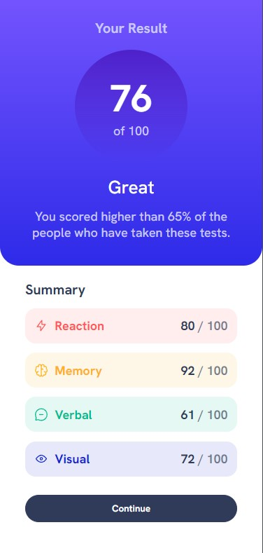
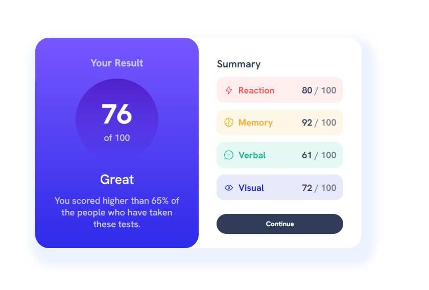
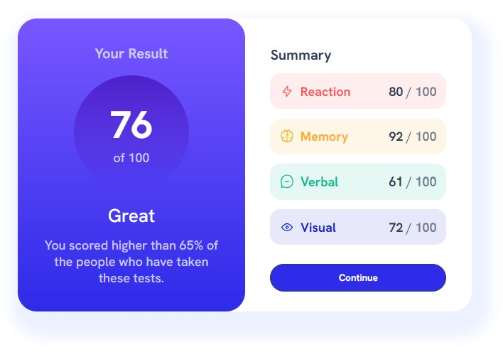

# Frontend Mentor - Results summary component solution

This is a solution to the [Results summary component challenge on Frontend Mentor](https://www.frontendmentor.io/challenges/results-summary-component-CE_K6s0maV). Frontend Mentor challenges help you improve your coding skills by building realistic projects.

## Table of contents

- [Overview](#overview)
  - [The challenge](#the-challenge)
  - [Screenshot](#screenshot)
  - [Links](#links)
- [My process](#my-process)
  - [Built with](#built-with)
  - [What I learned](#what-i-learned)
  - [Continued development](#continued-development)
- [Author](#author)

## Overview

### The challenge

Users should be able to:

- View the optimal layout for the interface depending on their device's screen size
- See hover and focus states for all interactive elements on the page

### Screenshot

Mobile

- Created breakpoint at 760px

Desktop

Active State - mouse invisible from screenshot method

### Links

- Solution URL: [GitHub Code]()
- Live Site URL: [Deployed with GitHub]()

## My process

### Built with

- Semantic HTML5 markup
- CSS
- Flexbox

### What I learned

- Greater understanding of Flexbox and its properties
- How margins and padding affected the box model and how content is displayed

### Continued development

- Figure out tips and tricks for combining CSS styles/ create more reusable code.
- Find resources on box model for stronger understanding
- Relearn how to make JS mingle with HTML to create more dynamic code (**re-create this project using the data.json file and JS**)

## Author

- Brittney Desroches
- Frontend Mentor - [@bdesroches10](https://www.frontendmentor.io/profile/bdesroches10)
